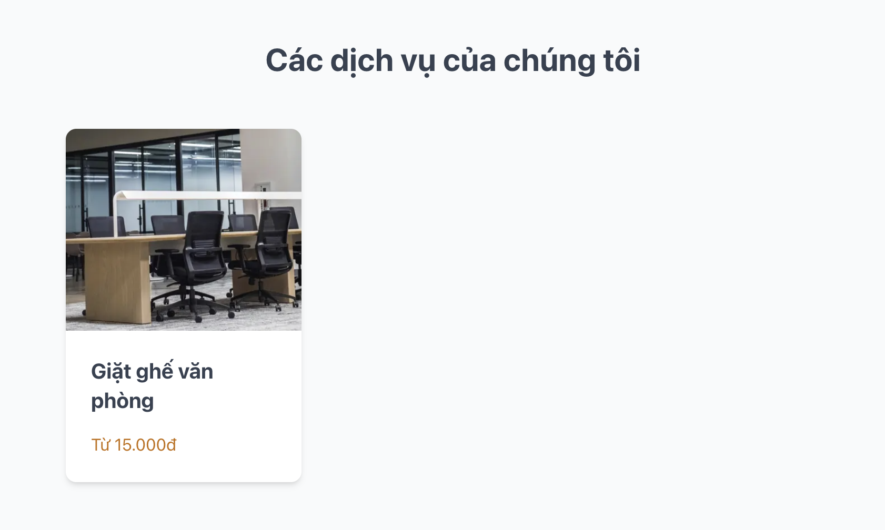
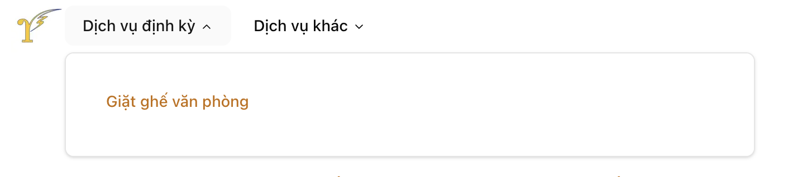

# Các bước tạo trang mới

## URL Path:
* Tạo trang mới trong thư mục `app/dich-vu/` với tên file là `{path}/page.tsx`, trong đó `{path}` là đường dẫn URL mà bạn muốn sử dụng cho trang mới. Ví dụ: nếu bạn muốn tạo trang có URL là `/dich-vu/ve-sinh`, thì bạn cần tạo file `app/dich-vu/ve-sinh/page.tsx`.

* Nội dung trang được định nghĩa bằng cú pháp [Markdown](https://www.markdownguide.org/cheat-sheet/) cơ bản hoặc các component đặc biệt được định nghĩa trong `components/mdx/`.

## Thêm tile trong landing page


Thêm đoạn code sau trong file `app/page.tsx`, nằm trong section `Services Cards`
```
<ServiceCard
  href="/dich-vu/{path}"
  name="{tên dịch vụ}"
  description="{mô tả dịch vụ}"
  price="{giá dịch vụ}"
  imageUrl="/{tên file ảnh}.jpeg"
/>
```

Ảnh được lưu trong thư mục `public` với định dạng `.jpeg`. Đường dẫn ảnh được sử dụng trong thuộc tính `imageUrl` là đường dẫn tương đối từ thư mục `public` đến file ảnh. Ví dụ: nếu file ảnh nằm trong thư mục `public/images`, thì đường dẫn sẽ là `/images/{tên file ảnh}.jpeg`.

## Tạo link trong menu


* Chọn nhóm dịch vụ tương ứng (Dịch vụ định kỳ / Dịch vụ khác).
* Thêm đoạn code sau trong file `components/navigation-menu.tsx` (Nằm giữa component `ul`):

```
<LinkItem
  title="{tên dịch vụ}"
  href="/dich-vu/{path}"
/>
```

