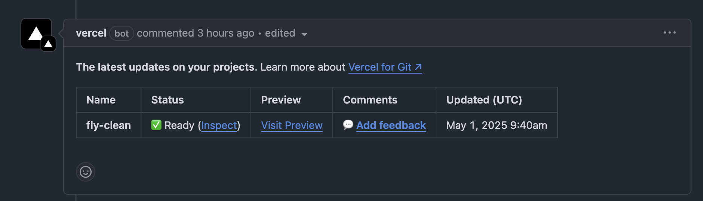

# Tạo pull-request mới

## Đặt tên branch
- Tên branch nên bắt đầu bằng tiền tố `feature/` hoặc `bugfix/` tùy thuộc vào loại thay đổi bạn đang thực hiện.

```aiignore
vd: feature/new-page
    bugfix/fix-typo
```

## Commit message

- Commit message nên ngắn gọn và mô tả rõ ràng về thay đổi bạn đã thực hiện. Sử dụng động từ ở dạng quá khứ để mô tả hành động đã hoàn thành.

```aiignore
vd: feature: Add new page for dịch vụ giặt ghế văn phòng
    bugfix: Fix typo in dịch vụ giặt ghế văn phòng
```

## Push branch & tạo pull request
- Sau khi đã commit các thay đổi của bạn, hãy push branch lên remote repository và tạo pull request từ branch đó đến branch chính (`master`)

- `Vercel` sẽ deploy bản preview và comment link vào pull request để bạn có thể xem trước các thay đổi của mình trên môi trường staging. Chọn `viset-preview` để xem trước các thay đổi của bạn trên môi trường staging.



## Merge pull request

- Sau khi đã kiểm tra và xác nhận các thay đổi của bạn là chính xác, hãy merge pull request vào branch chính (`master`).
- Vercel sẽ tự động deploy bản mới lên môi trường production.
